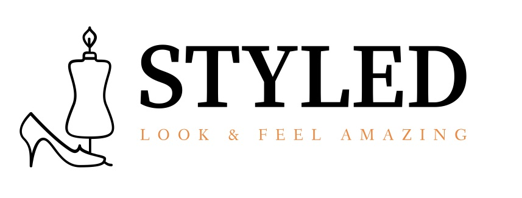
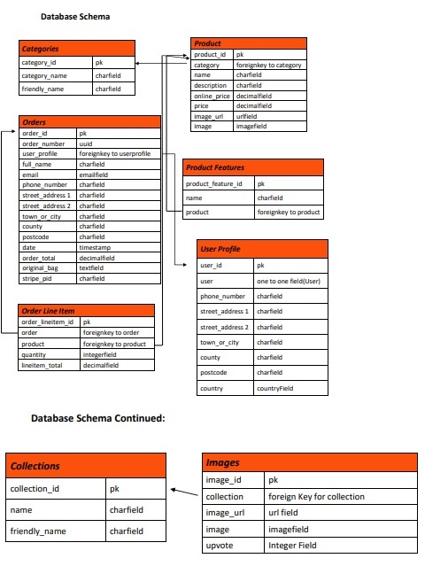

### **You can check out Styled** [Here](https://styled-el.herokuapp.com/)

## **_Milestone Project 4 - Full Stack Frameworks with Django_**

## **Project Description**
The purpose of the project is to build a full-stack site based around business logic used to control a centrally-owned dataset. Styled is a fictional personal stylist service offering a range of services such as Image Consultation, Personal Shopping, Body Analysis, Full Style Overhaul, Closet Clearout and Corporate Styling Events.  This goal of this project is to provide the user with the ability to purchase and avail of these services or purchase gift vouchers to purchase the services offered. Style is your personal brand and allows you to express yourself and who you are. Fashion is ever changing and it is easy to lose yourself in the sea of constantly shifting style trends. Everyone has their own unique signature style, being comfortable in your own style can boost your confidence if you feel good in what you are wearing. This website provides users the ability to learning how to dress for your body shape, style and personality and leave feeling confident and looking amazing. Additionally this site has also incorporated a Look Book gallery feature where users can find inspiration on outfits for different occasions. In the future I hope to expand on this feature by allowing users to upload their own outfit images and provide an upvote system on these images and links to where the clothing items or similar items can be purchased. I would also like to implement a feature where registered users could save these images to their profile as their favourite looks to view in one place.

### **_Business Objectives_**
- Provide a website that is professional and reflects the brand.
- Provide a website that is clear, attractive and inviting for users.
- Provide a website that is easy to navigate.
- Earn income on services and products purchased through the website.
- Develop a reliable brand with satisfied and loyal customers.
- Showcase the services and products on offer and provide users with clear service details(i.e prices, descriptions)
- Mange customer expectations online by providing a contact form to handle any suggestions, complaints or queries.
- Provide a secure online payment system
- Provide email confirmations for orders placed online.
- Provide instant feedback on all user actions throughout the site to alert users of any errors or to confirm that actions were successful.
- Allow users to create a profile and save their default information and order history.
- Easily manage, update and maintain the sites services and products.

### **_Customer Objectives_**
- To establish the purpose of the website immediately.
- To easily navigate the website.
- To be able to quickly search for the products and services they are looking for.
- A website that is attractive, inviting and interesting.
- To have the ability to create their own profile.
- To browse the services and products easily.
- Easily navigate to detailed information on services and products.
- A fast, secure and reliable payement system of purchasing items.
- Easily identify the total of my purchases at any time.
- The ability to update items in my shopping bag.
- The ability to delete items in my shopping bag.
- The ability to save my deafult information to my profile.
- The ability to easily register for a user account.
- The ability to easily login and logout of my user account.
- The ability to recover my password if it's forgotten.
- Receive an email confirmation of my orders.
- The ability to view my order history.
- Receive an email confirmation on signing up for an account
- The abiity to contact the site owners for any queries and issues I encounter.
- To access and view the site on multiple devices(phone, tablet, desktop)

### **_Future Goals_**
- Provide users with the option of an online service as well as an in-person service. This feature would allow users to select to purchase each service online or in-person with different price points.
- Allow users to upload their own images for the look book feature as outfit inspiration for other users on the site.
- Provide outfit detail links on all look book images to allow users to be directed to where they can purchase the items shown or similar items.
- Allow users to like/upvote the images within the look book gallery.
- Provide a gift voucher system where a unique code would be sent to the users email upon purchase.
- Provide registered users with discount codes to be redeemed online for any products or services offered.
- Provide a 'Tips & Tricks' vlog section on style advice and how to wear the latest fashion trends etc. that would be available to registered users as an extra perk for signing up.
- Allow users to submit reviews on the services provided and review their own experience for potential users.
- Provide users with the ability to log in from social media accounts.

## **UX Design**

### **_User Stories_**

### **_Visitors to the site expect:_**

### **_Strategy Plane_**

### **_Scope Plane_**

### **_Structure Plane_**

**Here is the site layout for this project:**

### **Database Architecture**

The database for this project was created using PostgreSQL in production and SQLite3 in development. 
It consists of 8 models:

- Categories
- Products
- Product Features
- Orders
- Order Line Items
- Users/User Profile
- Collections(For Look Book)
- Images (for Look Book)
- The collections were structured as follows:

### **_Skeleton Plane_**

### **_Wireframes Mockup_**
**Wireframes:**
- Desktop Wireframes can be viewed [here]()
- Tablet Wireframes can be viewed [here]()
- Mobile Wireframes can be viewed [here]()

### **_Surface Plane_**
#### **_Colours_**
- For this project, I decided to use a minimalist approach to the colour scheme as I wanted it to reflect the professional brand of the company. The colours chosen are white, black and orange. 
- The site uses alot of vivid imagery so for this reason I have kept the main background white, so as not to overshadow the images. The testimonial carousel has a bright orange background just to add a pop of colour without overwhelming the user.
- The text is mainly black with some orange text used to highlight some elements of text in areas such as the shopping bag, checkout page and form element labels.

#### **_Typography_**
- The fonts chosen for this project were 'Brygada 1918' for the logo and headers, as it has a nice design, a creative feel while also looking professional and clear, and is visually attractive. The body of the website uses the font 'Roboto Slab' as it reads well, and doesn't distract from the actual content of the site, while still looking professional.

#### **_Images_**
The images for this site were sourced from a variety of locations:

The carousel images on the homepage were sourced from Pexels.com & Unsplash.com
The services images and gift voucher images were sourced from Pexels.com 
The Look Book images were sourced from Pinterest.com
The logo image on the profile page and product details features section was created using Namecheap.
The logo images on the about page for the services were created for this project using Canva.

## **Features**
### **_CRUD Functionality_**

The CRUD functionality for this website works as follows:
#### **Users Can:**

#### **Admin Can:**

#### **Guest Users Can:**

### **_Navigation Bar & Footer_**
- The **navigation bar** is in a fixed position.
- Access to navigation elements on all pages for a user friendly experience.
- Consists of a **logo** to the left, which acts as a link back to the homepage, and **navigation links** to the right. These navigation links differ depending on the user status: 
- A guest user has access to:
- A registered user has access to:
- An admin user has access to:

- The navigation bar is **responsive**, and the links collapse into a **hamburger menu** for both 
tablet and mobile devices. 
- The footer is fixed at the bottom, and contains **copyright information** located in the center. 

### **_Homepage_**

### **_About Page_**

### **_Services Page_**

### **_Service Info Page_**

### **_Look Book Page_**

### **_Gift Voucher Page_**

### **_Contact Page_**

### **_Thank You Page_**

### **_Login Page_**

### **_Register Page_**

### **_Profile Page_**

### **_Add Product Page_**

### **_Edit Product Page_**

### **_Delete Product_**

### **_Add Product Feature Page_**

### **_Edit Product Feature Page_**

### **_Delete Product Feature_**

### **_Add Image Page_**

### **_Edit Image Page_**

### **_Delete Image_**

### **_Shopping Bag Page_**

### **_Checkout Page_**

### **_Checkout Success Page_**

## **Existing Features**

### **_General_**

### **_Apps_**

## **_Future Features Left to Implement_**

## **Defensive Design**

## **Technologies Used**
### **_Languages_**

### **_Databases_**

### **_Frameworks/Integrations_**

### **_Workspace_**

### **_Other_**

## **Testing**
- Full Testing Documentation can be found [here]()

## **Deployment**
This project was developed using Gitpod IDE, then pushed to GitHub where the repository was stored.
It is hosted on Heroku using automatic deployment from GitHub. Link to the live site [here](https://styled-el.herokuapp.com/)

#### **Requirements to Run this App**

### **Project Deployment**
#### **The following steps outline how the project was deployed to Heroku:**
##### **Step 1:**

### **To set up automatic deployment to Heroku:**

### **Deployment to Heroku from the CLI:**

### **To run the project locally:**
##### **Step 1:**

## **Credits**
### **Code**

### **Content**
### **Media**
**Images:**

### **Resources**
- Code Institute Content - specifically the Boutique Ado Project
- Slack Community
- Bootstrap Documentation
- Django Documentation
- WW3 Schools
- Stack Overflow
- YouTube
- Balsamiq Wireframes
- CSS Tricks
- Pinterest for Images
- Personal Stylist websites (Wishi, )
- Unsplash
- Pexels
- Scheme Colour
- Redketchup.io
- Beautifier.io
- Tutor Support

### **Acknowledgements**