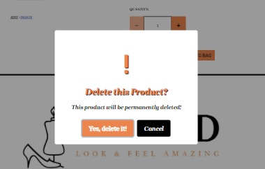

## **Testing**
Go Back to [README](README.md)

### **Tests Carried Out**

### **Validation**
**HTML**
- I used the [W3C Markup Validator](https://validator.w3.org/)
- I tested all HTML pages by either url link or the 'view source code' link on Google DevTools
- When I first ran my code through the HTML validator, there were a few minor errors
- I resolved these minor issues and ran all page through the validator again.
- The only remaining issues is a few minor error resulting from the crispy form rendering which I have highlighted in the 'Issues Encountered' section below. All other HTML code elements were validated.

**CSS**
- I used the [W3C CSS Validation Service](https://jigsaw.w3.org/css-validator/)
- All CSS code passed the validation process with no errors

**Javascript**
- I used [JSHint](https://jshint.com/)
- When I ran the Javascript code through the validator all code passed with no errors

**Python**
- I used [pep8online](http://pep8online.com/) to validate my Python code
- All code passed and meets the PEP8 standards.

### **General**
**_Check alt text appears for all images_**

- Hover over images to see if there is clear alt text visible.
All images were tested and alt text appears on images.

**_Conducted spell check on README file and text used in both HTML files._**

- All spelling errors were corrected.

**_Autoprefixer CSS_**

- Ran code through Autoprefixer and copied code back into css file.

**_Mobile Friendly Test_**

- Ran code on [Mobile Friendly Test](https://search.google.com/test/mobile-friendly) page and passed all tests. The site is mobile friendly.

**_Testing on physical devices_**

- I also asked friends and family members to test the website on many different devices including large screen laptops,
iPhone, android, android table and iPad and across a variety of browsers Internet Explorer, Google Chrome, and Firefox

### **User Story Tests**
**_As a user I would like to understand the purpose of the website._**
- The homepage carousel jumbotron states the purpose of the site clearly for all visitors.


**_As a user I want to be able to create my own profile that holds all my content._**
- Once a user registers for an account and verifies their email address they can access their own profile page. 
- This profile page contains the user's default delivery address which can be updated and their order history.


**_As a user, I want to be able to navigate the website with ease._**
- The navigation bar is in a fixed position and always on display
- The navigation links are clearly defined and change depending on user status.
- Call to action buttons are defined and easy to identify
- Redirects and buttons are provided to take the user to the targeted area.

**_As a user I expect to be able to quickly find products and services I am looking for._**
- The navigation bar provides links to all the products available on the website as well as a link for each service availble which will direct the user to that specific service information page.
- There is a search bar located on the navigation bar that is always accessible to all users. Users can quickly search for the product they are looking for using this functionality.


**_As I user I want to know the price of the products._**
- The all products page provides the price information for each service which is clearly defined and visible to the user immediately.
- The product price information is also clearly visible to the user on the product detail page below the product description.


**_As a user, I would like information about what is included in the service I am purchasing._**
- All services available on the site have a list of product features displayed at the bottom of the product detail page.
- These features outline the details of what will be included as part of each service and give further guidance and a better understanding of what is included as part of these services.


**_As I user I want to easily see the total price of my current shopping bag._**
- The total of the user's shopping bag is clearly displayed for the user below the shopping bag icon at all times.
- If the user adds an item to their shopping bag, this price is updated immediately to reflect this change and a success toast indicates to the user which items have been added and the associated costs.
- The shopping bag total is also visible from the shopping bag page which can be accessed by clicking the shopping bag icon on the navigation bar.


**_As a user I want the ability to update and delete items in my shopping bag._**
- The shopping bag page includes a quantity update functionality, where users can increase and decrease the quantity of each item.
- The update and delete links to handle this functionality are located directly below the quantity selector input.
- The user can use the update link to update the quantity of the items.
- The user can use the delete link to remove items from their shopping bag.


**_As a user I would like a profile that holds all the information on my previous orders._**
- There is a section of the profile page that contains the user's previous orders in their order history.
- This displayed in a column to the right on larger screens and at the top on mobile devices.
- It contains information such as order number, order date, order items and subtotal.
- The order number acts as a link for the user, and when clicked, will direct the user to the order confirmation page for that specific order.


**_As a user I would like to login and logout easily._**
- The login and logout links are available at all times on the navigation bar.
- The user can locate these links by navigating to the 'My Account' dropdown menu on the navbar and selecting the 'Login' or 'Logout' links.


**_As a user I would like receive email confirmation of any purchases made._**
- This is achieved through the use of Gmail. 
- Once an order is placed and the user has made payment successfully, a Bootstrap toast will alert the user that an email confirmation of their order has been sent to their email address.


**_As a user I would like to have all the order details specified in my email order confirmation._**
- The order confirmation email sent to the user contains all the order information including order number, order date, order items, delivery address, billing address and order total.


**_As a user, I would like to receive alerts/messages when I submit, enquire or make a purchase that inform me it was successful._**
- This is achieved through the implementation of Bootstrap toasts. I have set up toasts for warnings, errors, information and success messages.
- These are triggered when a user action is completed.
- A success message will be displayed to the user at top right hand corner of the screen when, a purchase has been made, the user has logged in, the user has logged out, added an item to their bag, updated an item in their bag or deleted an item from their bag.
- In the contact form page, once the contact form has been sent successfully, the user will be directed to the thank you page where the user is informed that their email has been sent successfullly.


**_As a user, I would like to have access to a fast secure payment system when purchasing items._**
- This is achieved through the use of Stripe as a fast, reliable and secure payment system for users.

**_As a new user, I would like the ability to register for a user account_**
- New users can easily register for an account on the website.
- There is a 'Register' link provided in the 'My Account' dropdown menu on the navigation bar.
- The user is directed to the register page where they will be asked to complete the registration form by providing a username, email and password.
- The user will then be sent an email to verify their email.
- Once the email has been verified, the user can then log into their account using the 'Login' link provided in the navigation bar.


**_As a user, I would like the ability to recover my password._**
- On the 'Login' page a 'Forgot Password' link is provided at the end of the login form.
- This link is highlighted in orange.
- A user can click this link and will be directed to the reset password page.
- Here a user will be asked to enter their email address and a reset password link will be sent to the email address provided.
- User can then navigate to their emails, click on the link provided and will be directed to the set password page.
- From here they have the ability to set a new password and login with the new password they just created.


**_As a user I would like the ability to be able to communicate with the company via email from the site._**
- This website provides a 'Contact Us' page which can be accessed directly from the navigation bar that is always visible to the user.
- This link directs the user to the contact page form which includes fields for the user's email, a subject and their message.
- All fields are required and will result in an error if not filled in correctly.
- Once validated, the user can click the 'Send' button to submit the message.
- This email is then sent directly to the company email address via Gmail.
- The user is then directed to the thank you page which will inform them that the message was sent successfully and someone will respond as soon as possible.


**_As the owner and user, I want to encourages users to make purchases and earn an income._**
- This website is an e-commerce website that allows users to purchase the products and services available.
- Stripe is used to allow for fast, reliable and secure payment transactions on the site.

**_As the owner and user, I want to be able to add, update or delete products on the website._**
- Admin users have extra functionality throughout the website.
- Under the 'My Account' dropdown menu in the navigation bar, an admin user an admin user can select 
    - Product Managment (allows an admin user to add a product to the database)
- Admin users also have the ability to edit and delete products.
- These update and delete links are provided in both the product detail page page directly below the product image.
- The delete functionality also has an added security measure using a Sweet Alert popup confirmation that will prompt the user to check if they are sure they wish to delete the product.
- The user then has a choice to confirm or cancel the delete action. This is to ensure that no items are deleted accidentally from the database.




**_As the owner and user, I want the ability to create, update and delete product features._**
- Admin users have extra functionality throughout the website.
- Under the 'My Account' dropdown menu in the navigation bar, an admin user can select
    - Product Feature Management(allows an admin user to add a product feature to the database)
- Admin users also have the ability to edit and delete product features.
- These update and delete links are provided in both the product detail page directly below the product image.
- The delete functionality also has an added security measure using a Sweet Alert popup confirmation that will prompt the user to check if they are sure they wish to delete the product feature.
- The user then has a choice to confirm or cancel the delete action. This is to ensure that no items are deleted accidentally from the database.


**_As the owner and user, I want the ability to create, update and delete gallery images._**
- Admin users have extra functionality throughout the website.
- Under the 'My Account' dropdown menu in the navigation bar, an admin user can select
    - Look Book Management(allows an admin user to add an image to the database)
- Admin users also have the ability to edit and delete images.
- These update and delete links are provided in both the Look Book gallery page directly below the image.
- The delete functionality also has an added security measure using a Sweet Alert popup confirmation that will prompt the user to check if they are sure they wish to delete the image.
- The user then has a choice to confirm or cancel the delete action. This is to ensure that no items are deleted accidentally from the database.


**_As the owner and user, I want other users to be able to contact me if they have any questions or complaints or general feedback._**
- Users can contact the company owners through the contact form provided on the contact page.
- This form is set up to send the email form directly to the site owner's Gmail account.
- The email will include the user's email so that the site owner can respond directly to the user.


**_As the owner and user, I want provide users with incentive to sign up._**
- Registered users have added benefits when they sign up for a user account on the website.
- Registered users have access to a profile page of their own which contains their default delivery information and their order history.


**_As a guest user, I would like to be able to search for products and services._**
- A guest user can access all the products and services available on the website.
- They can access these through the navigation bar, via the services dropdown menu and gift voucher links provided. These are visible to users at all times.
- They can also access the products and services through the use of the search bar functionality on the navigation bar.


### **Site Functionality**
| **Test**  | **Test Action**  |  **Expected Outcome** |  **Test Result** |   |
|---|---|---|---|---|
|**_Navigation Links_**   |  Test that all navigation links take the user to the correct page | All navigation links should take the user to the correct targeted page  | Pass - The navigation links all work as intended and operate correctly. |   |
| **_Navigation links should change depending on user status_**  | Access the site as different user types and check navbar links are correct  |  The correct links are visible to Admin, Registered Users and Guest Users of the site | Pass - All intended links are showing up depending on user status  |  |
| **_Navigation bar responsiveness_**  | Check responsiveness of navigation bar using Chrome DevTools to check if it worked across all devices  | The navigation bar is fully responsive, showing links to the right hand side on larger screens and collapses into a hamburger menu on medium and smaller devices.  | Pass - Navbar is working as expected and is responsive |   |
| **_Navigation links change to orange colour on hover/focus_** | Go to navigation menu and hover over nav links |  Navigation links change to orange colour when hovered over| PASS - Test was successful and navigation links change to orange on hover/focus |   |
| **_Hamburger Toggle menu closes after nav item selection_**  | Use Dev Tools to inspect website on mobile device, click on hamburger menu, select a link  |  Hamburger menu closes when link is selected |  Pass - This test was a success |   |
| **_Service dropdown links direct user to correct page_**  | Go to website and check all dropdown links on the Services dropdown are working as expected  |  All links work and direct user to the targeted page |  Pass - This test was successful and all links on the Services dropdown menu take the user to the correct pages. |   |
| **_Look Book dropdown links direct user to correct page_**   | Go to website and check all dropdown links on the Look Book dropdown are working as expected |  All links work and direct user to the targeted page|  - This test was successful and all links on the Look Book dropdown menu take the user to the correct pages. |   |
| **_Check that all Management links for Admin Users_** | Sign in as an Admin user and navigate to 'My Account' dropdown menu and check all management links are working correctly  |  All management links take the user to the correct designated pages |  Pass - This test was successful and all links work as expected. |   |
| **_Homepage Carousel Images Responsiveness_**  | Using DevTools on Google Chrome, inspect how the site looks on different devices. Expand and reduce the screen size to make sure the images are responsive on all devices and look good.  | The homepage carousel images are fully responsive across all devices. |  Pass - all carousel images are responsive. |   |
| **_Image carousels working_**  | Go to site and check that the carousel images are transitioning to all show all images and content  |  Carousels are working as expected and showing all content |  Pass - carousels on homepage are working as expected. |   |
| **_Callout on homepage image carousel is responsive_** | Using DevTools on Google Chrome, inspect how the site looks on different devices. Expand and reduce the screen size to make sure the images are responsive on all devices and look good.  |  Callout is responsive and looks good on all devices |  Pass - callout functions as expected. |   |
| **_Callout button on homepage takes user to the correct targeted page_**  | Click on the callout button on the homepage  |  Directs the user to the Style Services Page |  Pass - the callout button works and takes the user to the Style Services page as expected. |   |
| **_Search Bar Functionality_** | Check that the search bar functions properly and directs the user to the products page related to their search by searching for a product  |  Search functionality works and a list of results are displayed on the products page including the number of results for the search | Pass - the search bar works as expected and returns the correct results to the products page. |   |
| **_Search Bar Empty Error Message_** | Submit a search using the search bar with no text |  An error message appears at the top right hand corner telling the user they did not enter any search criteria | Pass - the error message is displayed as expected. |   |
| **_Sign In Link Works_** | Click on the Sign in link under 'My Account' dropdown menu in navbar |  Directs the user to the sign in page |  Pass - the test was successful and the user is directed to the sign in page |   |
| **_Sign In Form Functionality_**  | Navigate to the sign in page and log in |  User is able to sign into their account and a success message is displayed |  Pass - user is able to log in and a success message is displayed. |   |
| **_Sign In Form - invalid_** | Navigate to sign in page and enter incorrect username or password |  User is alerted of the error and directed to the field that requires fixing |  Pass - user cannot log in if form is invalid and is prompted to fix the errors on the specified fields |   |
| **_Register Link Works_** | Click on the Register link under 'My Account' dropdown menu in navbar |  Directs the user to the register page |  Pass - the test was successful and the user is directed to the register page |   |
| **_Registration Functionality_**  | Navigate to the registration page and complete the registration form |  User is able to register account and a success message is displayed telling the user an email has been sent to them to verify their email |  Pass - user is able to register and a success message is displayed as expected. |   |
| **_Register Form - invalid_** | Register for an account and input a username/email already in the database  |  User is alerted that username/email already exists | Pass - User cannot register with same username or email as a registered user. |   |
| **_Registration email is successfully received_** | Register for an account and add a temp email  |  User recieves an email to verify their email address |  Pass - Email was received successfully |   |
| **_Registration verify email link works and directs user to the login page_** | Register for an account and use a temp email  |  Link works and user is directed to the website login page |  Pass - This test was successful and verify email address link works as expected. |   |
| **_About Page Image & Content Responsiveness_**  | Check responsiveness of about page using Chrome DevTools to check if it looks well on all devices. Expand and reduce the screen size to make sure the images and content are responsive on all devices. |  About Page images and content is fully responsive across all devices.  |  Pass - About Page images and content are fully responsive on all devices.|   |
| **_About Page Icons Responsiveness_**  | Check responsiveness of icons using Chrome DevTools to check if they work and look good on all devices. Expand and reduce the screen size to make sure the icons are responsive on all devices.  |  Icons are fully responsive across all devices |  Pass - Icons are fully responsive as expected. |   |
| **_About Page Icon Links Work_**  | Click on each service icon 'More Info' button on About Page |  Each service button link will direct the user to the product detail page for that specific service| Pass - all 'More Info' buttons below each service icon work as expected. |   |
| **_About Page Team Card Responsiveness_** | Check responsiveness of team cards using Chrome DevTools to check if they work and look good on all devices. Expand and reduce the screen size to make sure the images and content are responsive on all devices.  |  Styled Squad team member cards are fully responsive across all devices |  Pass - cards are fully responsive as expected. |   |
| **_Product Cards Responsiveness_**  | Check responsiveness of product cards using Chrome DevTools to check if they work and look good on all devices. Expand and reduce the screen size to make sure the images and content are responsive on all devices.  | Product cards are fully responsive across all devices | Pass - cards are fully responsive as expected. |   |
| **_Products Page - Results Link_**  | Navigate to the products page and click on the link next to the number of results in the top left of the page  | Link directs the user to the Styled Services Page | Pass - link works as expected |   |
| **_Image Link on Products Page Works_** | Navigate to the products page and click on the product image |  User is directed to the product detail page for that specific product. |  Pass - link works as expected. |   |
| **_Scroll to Top Button Brings User to top of page_** | Navigate to the products page and scroll to the bottom and click the arrow button  |  Directs the user back to the top of the products page |  Pass - button works and the user is directed back to the top of the page with ease. |   |
|**_Product Detail Cards Responsiveness_** | Check responsiveness of product cards using Chrome DevTools to check if they work and look good on all devices. Expand and reduce the screen size to make sure the images and content are responsive on all devices.  |  Product cards are fully responsive across all devices | Pass - cards are fully responsive as expected. |   |
| **_Product Detail Quantity Selector Works_** | Navigate to the product detail page and increase and decrease the quantity  |  Quantity will increase and decrease with plus and minus buttons | Pass - quantity selctor input element works as expected. |   |
| **_Product Detail Link back to Styled Services Category Works_** | Navigate to the product detail page and click on the link at the top left of the page beside the number of results  |  Link directs the user back to the Styled Services products page |  Pass - Test was successful and link directs the user to the Styled services products page.|   |
| **_Product Detail features list responsiveness_**  | Check responsiveness of product features lsit using Chrome DevTools to check if they work and look good on all devices. Expand and reduce the screen size to make sure the content are responsive on all devices.  |  Product features section is fully responsive across all devices | Pass - product features are fully responsive as expected. |   |
| **_Product Detail Add to Bag Button Works_**  | Navigate to the product detail page and click on the Add to Bag button  |  Button works and item is successfully added to the user's bag |  Pass - Add to Bag button works as expected. |   |
| **_Product Detail Keep Shopping Button Works_** | Navigate to the product detail page and click on the Keep Shopping button |  Button works and directs the user to the all products page to continue browsing for products |  Pass - Keep Shopping button works as expected. |   |
| **_Product Detail Edit link works_**  | Sign in as Admin user and navigate to product detail page and click the edit link under the product image | User is directed to the edit product page |  Pass - link works as expected|   |
| **_Product Detail Delete link works_** | Sign in as admin user and navigate to the product detail page and click the delete link under the product image  |  The delete link triggers a Sweet Alert popup to ask the user to confirm or cancel the delete action |  Pass - Sweet Alert popup is triggers on delete link click as expected. |   |
| **_Sweet Alert Popup Confirm & Cancel Buttons work_** | Login as admin user and click the delete link under the product image. click the cancel button and then repeat the action but this time click the confirm button. |  Clicking the cancel button on the popup should close the alert and clicking confirm on the popup should successfully delete the product and alert the user of the action undertaken.| Pass - the cancel link closes the popup as expected and the confirm button deletes the product and alerts the user to the successful delete action as expected. |   |
| **_Product Feature Edit link works_**  | Sign in as Admin user and navigate to product detail page and click the edit link  | User is directed to the edit product page |  Pass - link works as expected|   |
| **_Product Feature Delete link works_** | Sign in as admin user and navigate to the product detail page and click the delete link under the product feature |  The delete link triggers a Sweet Alert popup to ask the user to confirm or cancel the delete action |  Pass - Sweet Alert popup is triggers on delete link click as expected. |   
| **_Product Feature Sweet Alert Popup Confirm & Cancel Buttons work_** | Login as admin user and click the delete link under the product feature. click the cancel button and then repeat the action but this time click the confirm button. |  Clicking the cancel button on the popup should close the alert and clicking confirm on the popup should successfully delete the feature and alert the user of the action undertaken.| Pass - the cancel link closes the popup as expected and the confirm button deletes the feature and alerts the user to the successful delete action as expected. |   |
| **_Gift Vouchers Page Image & Content Responsiveness_**  | Check responsiveness of about page using Chrome DevTools to check if it looks well on all devices. Expand and reduce the screen size to make sure the images and content are responsive on all devices. |  Gift Voucher Page images and content are fully responsive across all devices.  |  Pass - Gift Voucher Page images and content are fully responsive on all devices.|   |
| **_All Products link works_**|  Navigate to the giftvoucher page and click on the link at the top left of the page beside the number of results  |  Link directs the user back to the all products page |  Pass - Test was successful and link directs the user to the all products page.|   |
| **_Scroll to Top Button Brings User to top of page_** | Navigate to the products page and scroll to the bottom and click the arrow button  |  Directs the user back to the top of the products page |  Pass - button works and the user is directed back to the top of the page with ease. |   |
| **_Gift Voucher image link works_** | Navigate to the gift vouchers page and click on the gift voucher image |  User is directed to the product detail page for that specific gift voucher. |  Pass - link works as expected. |   |
| **_Gallery Page Image Responsiveness_** | Check responsiveness of gallery page using Chrome DevTools to check if it looks well on all devices. Expand and reduce the screen size to make sure the images and content are responsive on all devices. |  Gallery Page images and content is fully responsive across all devices.  |  Pass - Gallery Page images and content are fully responsive on all devices.|   |
| **_Gallery Page Badges populate correct collections_** | Navigate to 'All Looks' page and check that correct badges are displayed, then click on each badge and check that correct badge is displayed at the top |  All correct collection names and corresponding badges are displayed on the gallery pages | Pass - Test was a success and badges are showing up as expected on all gallery pages. |   |
| **_Gallery Page 'Looks' link works_** |  Navigate to the gallery page and click on the link at the top left of the page beside the number of results 'Looks'  |  Link directs the user back to the 'All Looks' gallery page |  Pass - Test was successful and link directs the user to the all looks gallery page.|   |
| **_Gallery Page Edit link works_**  | Sign in as Admin user and navigate to gallery page and click the edit link under the image  | User is directed to the edit product page |  Pass - link works as expected|   |
| **_Gallery Page  Delete link works_** | Sign in as admin user and navigate to the gallery page and click the delete link under the image  |  The delete link triggers a Sweet Alert popup to ask the user to confirm or cancel the delete action |  Pass - Sweet Alert popup is triggers on delete link click as expected. |   |
| **_Sweet Alert Buttons work_** | Login as admin user and click the delete link under the gallery image. click the cancel button and then repeat the action but this time click the confirm button. |  Clicking the cancel button on the popup should close the alert and clicking confirm on the popup should successfully delete the image and alert the user of the action undertaken.| Pass - the cancel link closes the popup as expected and the confirm button deletes the image and alerts the user to the successful delete action as expected. |   |
| **_Scroll to top button takes user back to top of page_** |Navigate to the products page and scroll to the bottom and click the arrow button  |  Directs the user back to the top of the products page |  Pass - button works and the user is directed back to the top of the page with ease. |   |
| **_Contact Page form is responsive_** |  Check responsiveness of contact form using Chrome DevTools to check if it looks well on all devices. Expand and reduce the screen size to make sure the form is responsive on all devices. |  Contact form is fully responsive across all devices.  |  Pass - Contact form is fully responsive on all devices.|   |
| **_Contact form fields required_** | Try to submit the contact form with empty fields  |  Submit button will not submit the form and the user will be directed to the fields with errors that will need to be fixed. |  Pass - user cannot submit the form without completing the required field inputs. Test was a success.|   |
| **_Contact Form errors are displayed_**| Fill in contact form with errors |  Form will not be submitted and any errors will be highlighted and the user will be alerted of any errors on the form |  Pass - this test was successful and the user is directed to the fields that contain errors and are directed to fix these before submitting the form |   |
| **_Contact Form won't submit unless valid_** | Complete the contact form with incorrect details such as numbers for the email field |  Form will not be submitted and any errors are highlighted and user is directed to these fields to correct any errors before submitting. |  Pass - the contact form will not be submmitted unless it is valid. Test was a success. |   |
| **_Contact Form email is successfully sent to company Gmail account_** | Complete and submit the contact form, log into company Gmail account and check for email. |  Contact form email is sent and received in the company Gmail inbox |  Pass - this test was successful and all contact form emails are sent directly to the site owner Gmail account.|   |
| **_Contact Form Email displays correct details to site owners once received_** | Log into company Gmail account and check that contact form email displays all the necessary information it should include  |  Email is received and all necessary details are included |  Pass - this test was a success and all contact form emails contain the relevant information from the form as expected. |   |
| **_Thank You Page - user is directed to thank you page on successful contact form send_** | Complete and submit the contact form on the Contact Page  |  If contact form is submitted successfully the user is directed to the Thank You page |  Pass - This test was a success and on successfully submission of the contact form, the user is directed to the thank you page as expected. |   |
| **_Thank You page responsiveness_** | Check responsiveness of thank you page using Chrome DevTools to check if it looks well on all devices. Expand and reduce the screen size to make sure the thank you page is responsive on all devices. |  Thank you page is fully responsive across all devices.  |  Pass - Thank You Page is fully responsive on all devices.|   |
| **_Thank you Page button takes user back to Gallery Page_** | Complete and submit the contact form, this will direct the user to the thank you page, click the button 'Check Out Our Looks'  |  Button works and directs the user to the Gallery Page | Pass - This test was a success and button works as expected.|   |
| **_Profile Page Image is responsive_** | Check responsiveness of image on profile page using Chrome DevTools to check if it looks well on all devices. Expand and reduce the screen size to make sure the image is responsive on all devices. |  Profile page image is fully responsive across all devices.  |  Pass - Profile Page image is fully responsive on all devices.|   |
|**_Profile page is responsive_** | Check responsiveness of profile page using Chrome DevTools to check if it looks well on all devices. Expand and reduce the screen size to make sure the page content is responsive on all devices. |  Profile page content is fully responsive across all devices.  |  Pass - Profile Page content is fully responsive on all devices.|   |
| **_Profile Page - users correct order history is displayed_** | Log in as a registered user and make a purchase then go to the profile page and check the correct order history is displayed.  | Correct order history is displayed for the user on their profile page. | Pass - this test was successful and all registered user's orders are displayed with correct information on their profile page as expected. |   |
| **_Profile Page - users correct default delivery information is displayed_**| Log in as a registered user and make a purchase and select the save-info box, then go to the profile page and check that the default delivery information matches the address added in the checkout form. | Correct default delivery information is displayed for the user on their profile page. | Pass - this test was successful and the registered user's default information are displayed with correct information on their profile page as expected. 
| **_Profile Page update info button works_** | Log in as a registered user and navigate to the profile page, edit the default delivery information and click update information button |  User's new details are saved and the edited address matches the changes made to it. |  Pass - this test was a success an the update information button works as expected. |   |
| **_Order number link to order confirmation works_** | Navigate to the profile page and click on the order number link  | Directs the user to the order confirmation for that specific order |  Pass - this test was a success and directs the user to the correct order confirmation for that specific order as expected.|   |
| **_Order Confirmation displays the correct information for the specified order_** |Navigate to the profile page and click on the order number link and check that the information details are correct |  All orer details are correct and match the specific order placed by the user |  Pass - this test was a success and all order details matched the order and order form placed and completed by the user as expected.|   |
| **_User's name is displayed at the top of the profile page on the welcome message_**| Log in as a registered user and navigate to the profile page |  The header under the Profile heading should read 'Welcome (User's Name) |  Pass - this test was successful and the user's name is displayed on the welcome message on the profile page |   |
| **_Shopping Bag Page responsiveness_** | Check responsiveness of shopping bag page using Chrome DevTools to check if it looks well on all devices. Expand and reduce the screen size to make sure the page content is responsive on all devices. |  Shopping page content is fully responsive across all devices.  |  Pass - Shopping Page content is fully responsive on all devices.|   |
|**_ Shopping Bag Page - items in bag are correct_** | Add items to the shopping bag and navigate to the shopping bag page and check that items are correct |  Shopping bag items are correct and match what has been added to the bag |  Pass - this test was a success and all items and quantities in the shopping bag are correct as expected |   |
| **_Shopping Bag Page - Correct bag total_** | Add items to the shopping bag and navigate to the shopping bag and check if total is correct |  Shopping bag total calculates to the correct amount | Pass - this test was success and the shopping bag total accurately calaculates the correct total based on price and quantity in the shopping bag as expected. |   |
|**_Shopping Bag Page - quantity selector works_** | Add items to the shopping bag and navigate to the shopping bag page and use the plus and minus quantity selector buttons to increase and decrease the quantity of items |  Quantity selector works and increases and decreases the quantities of each item |  Pass - this test was a success and the quantity selector works as expected |   |
| **_Shopping Bag Page - Update link works_** | Add items to the bag and navigate to the shopping bag and increase or decrease the quantity for the item, click the update link |  This update link updates the quantity of the item to the new amount |  Pass - this test was successful and the update link correctly adjust the quantity of the item in the shopping bag as expected. |   |
| **_Shopping Bag Page - Remove link works_** | Add items to the bag and navigate to the shopping bag and click the remove link  |  Item is removed from the user's shopping bag |  Pass - this test was a success and the item is successfully removed from the user's bag and works as expected. |   |
| **_Shopping Bag Page - Keep Shopping Button works_** | Navigate to the shopping bag page and click on the Keep Shopping button  |  Button works and the user is directed back to the all products page to continue browsing for products |  Pass - Keep Shopping button works as expected. |   |
| **_Shopping Bag Page - Secure Checkout Button works_** | Add items to the bag and navigate to the shopping bag page and click on the Secure Checkout button  |  Button works and user is directed to the checkout page to complete their order |  Pass - Secure Checkout button works as expected. |   |
| **_Checkout Page responsiveness_** |  Check responsiveness of checkout page using Chrome DevTools to check if it looks well on all devices. Expand and reduce the screen size to make sure the page content is responsive on all devices. |  Checkout page content is fully responsive across all devices.  |  Pass - Checkout Page content is fully responsive on all devices.|   |
| **_Checkout form fields are required_** | Try to submit the checkout form with empty fields  |  Submit button will not submit the form and the user will be directed to the fields with errors that will need to be fixed. |  Pass - user cannot submit the form without completing the required field inputs. Test was a success.|   |
| **_Checkout form field errors are displayed to the user_** |Fill in checkout order form with errors |  Form will not be submitted and any errors will be highlighted and the user will be alerted of any errors on the form |  Pass - this test was successful and the user is directed to the fields that contain errors and are directed to fix these before submitting the form |   |
| **_Checkout form will not be submittted unless valid_** | Complete the checkout order form with incorrect details such as numbers for the email field |  Form will not be submitted and any errors are highlighted and user is directed to these fields to correct any errors before submitting. |  Pass - the checkout order form will not be submmitted unless it is valid. Test was a success. |   |
| **_Checkout form card errors are displayed to the user_** | Fill in incorrect card details in the payment section of the checkout page |  User is alerted to payment errors and errors message is displayed.|  Pass - card errors on checkout page are highlighted and displayed to the user as expected. |   | 
| **_Checkout order items are correct_** | Add items to the bag and secure checkout, when user is on the checkout page, check that the items are correct and match the items in the shopping bag |  Items in checkout page match the items in the user's shopping bag |  Pass - this test was a success and the correct items are displayed in the checkout page and match the items from the shopping bag page as expected. |   |
| **_Checkout Page loading spinner appears on form submit_** | Complete the checkout order form and click complete order  |  Loading spinner is triggered and shows the user that the order is being processed |  Pass - the loading spinner is triggered as expected. |   |
| **_Checkout form Adjust bag button works_** | Navigate to the checkout page and click on the Adjust Bag button  |  Button works and the user is directed back to the shopping bag where they can adjust items in the bag |  Pass - Adjust Bag button works as expected. |   |
| **_Checkout Form Complete Order button works_** | Navigate to the checkout page and click on the Complete Order button  |  Button works as long as form is valid, the loading spinner is triggered if order is a success, the user is directed to the checkout success page |  Pass - Complete Order button works as expected. |   |
| **_Webhooks sent successfully from Stripe_** | Two methods: 1. Send test webhook from Stripe account and check if it was successful. 2. Add items to the bag, complete a purchase and navigate to Stripe account and check if the webhook was sent successfully.  | All webhooks are sent successfully |  Pass - All test webhooks were sent successfully (payment_intent_created, payment_intent_succeeded etc.) as expected. |   |
| **_Checkout Success Page - user is alerted via toast success message that the order was successful_** | Place an order on the website and check for alert on checkout success page |  Bootstrap success toast alerts the user that the purchase was successful and that an order confirmation was sent to their email address. |  Pass - this test was a success and toast success message appears as expected. |   |
| **_Checkout Success Page - user is alerted via toast success message that the order confirmation was sent to the user's email_** |Place an order on the website and check for alert on checkout success page |  Bootstrap success toast alerts the user that the purchase was successful and that an order confirmation was sent to their email address. |  Pass - this test was a success and toast success message appears as expected. |   |
| **_Checkout Success Page - order confirmation displays the correct information_** | Place an order on the website and when directed to the checkout success page check that the order details are displaying the correct information  |  Order confirmation displays the correct order details that match the order placed by the user |  Pass - this test was a success and the order confirmation details are correct as expected |   |
| **_Checkout Success Page responsiveness_** | Check responsiveness of checkout success page using Chrome DevTools to check if it looks well on all devices. Expand and reduce the screen size to make sure the page content is responsive on all devices. |  Checkout success page content is fully responsive across all devices.  |  Pass - Checkout Success Page content is fully responsive on all devices.|   |
| **_Checkout Success Page button takes user to the gallery page_** | On the checkout success page, click the 'Check Out Our Looks' button  |  Button directs the user to the 'Look Book' gallery page. |  Pass - this test was a success and works as expected. |   |
| **_Add Product Page responsiveness_** | Check responsiveness of Add Product page using Chrome DevTools to check if it looks well on all devices. Expand and reduce the screen size to make sure the page content is responsive on all devices. |  Add Product page content is fully responsive across all devices.  |  Pass - Add Product Page content is fully responsive on all devices.|   |
| **_Add Product Page - form displayed correct fields_** | Log in as Admin user and navigate to the Product Management link in the 'My Account' dropdown menu and check form fields | Form displays all the correct associated fields |  Pass - this test was a success and all relevant form fields are displayed as expected. |   |
|**_Add Product Page - form must be valid to submit successfully_** | Log in as Admin user and navigate to the Product Management link in the 'My Account' dropdown menu and submit and empty form, and then submit a form with errors  |  The form will not be submitted and errors and fields to be completed will be highlighted for the user |  Pass - this test was a success and form cannot be submitted unless it is valid, worked as expected. |   |
| **_Add Product Page - form errors are highlighted for the user_**| Log in as Admin user and navigate to the Product Management link in the 'My Account' dropdown menu and submit a form with errors in the fields  |  The form will not be submitted and errors will be highlighted for the user to fix |  Pass - this test was a success and all form errors are highlighted for the user as expected. |   |
| **_Add Product Page - if form is valid the Add Product button works_** | Complete the add product  form and click the add product button  |  Add Product form is submitted (if valid) |  Pass - Add Product button works as expected. |   |
| **_Add Product Page - if form is valid product is successfully added to the database_** | Log in as Admin user and navigate to the Product Management link in the 'My Account' dropdown menu and submit a form with all fields valid |  On submitting a valid form, the product is successfully added to the database| Pass - this was a success and the product was added to the database as expected.|   |
| **_Add Product Page - user is alerted via Bootstrap toast that product was added successfully_** | Complete the add product form and click the add product button  |  Product is added to the database and the user is alerted via Bootstrap toast message that this action was successful | Pass - Toast message is displayed to the user as expected. This test was a success. |   |
| **_Add Product Page - form Cancel button works_** | Complete the add product form and click the cancel button  |  The user is redirected to the all products page |  Pass - Cancel button works as expected. |   |
| **_Add Product Page - confirm product was added to the database_** | Login in to the Django admin and search for the product added  |  Product has been added to the database |  Pass - product was added to the database as expected. |   |
|**_Edit Product Page responsiveness_** | Check responsiveness of Edit Product page using Chrome DevTools to check if it looks well on all devices. Expand and reduce the screen size to make sure the page content is responsive on all devices. |  Edit Product page content is fully responsive across all devices.  |  Pass - Ediit Product Page content is fully responsive on all devices.|   |
| **_Edit Product Page - form displayed correct fields_** | Log in as Admin user and navigate to the product detail page and click the edit link under the product image and check form fields | Form displays all the correct associated fields |  Pass - this test was a success and all relevant form fields are displayed as expected. |   |
| **_Edit Product Page - form is auto populated with the correct product information_** | Log in as Admin user and navigate to the product detail page and click the edit link under the product image and check form fields have the correct product information auto populated in the form| Form displays all the correct associated field information for the specified product |  Pass - this test was a success and all relevant form field information are displayed as expected. |   |
| **_Edit Product Page - form must be valid to submit successfully_** | Log in as Admin user and navigate to the product detail page and click the edit link under the product image and and submit and empty form, and then submit a form with errors  |  The form will not be submitted and errors and fields to be completed will be highlighted for the user |  Pass - this test was a success and form cannot be submitted unless it is valid, worked as expected. |   |
| **_Edit Product Page - form errors are highlighted for the user_** | Log in as Admin user and navigate to the product detail page and click the edit link under the product image and submit a form with errors in the fields  |  The form will not be submitted and errors will be highlighted for the user to fix |  Pass - this test was a success and all form errors are highlighted for the user as expected. |   |
| **_Edit Product Page - if form is valid product is successfully updated in the database_** |Log in as Admin user and navigate to the product detail page and click the edit link under the product image and submit a form with all fields valid |  On submitting a valid form, the product is successfully updated the database| Pass - this was a success and the product was updated in the database as expected.|   |
| **_Edit Product  Page - user is alerted via Bootstrap toast that product was updated successfully_** | Complete the edit product form and click the edit product button  |  Product is updated the database and the user is alerted via Bootstrap toast message that this action was successful | Pass - Toast message is displayed to the user as expected. This test was a success. |   |
| **_Edit Product Page - if form is valid the Edit Product button works_** | Complete the edit product  form and click the edit product button  |  Edit Product form is submitted (if valid) |  Pass - Edit Product button works as expected. |   |
| **_Edit Product Page - form Cancel button works_** | Complete the edit product form and click the cancel button  |  The user is redirected to the all products page |  Pass - Cancel button works as expected. |   |
| **_Add Product Feature Page responsiveness_** | Check responsiveness of Add Product Feature page using Chrome DevTools to check if it looks well on all devices. Expand and reduce the screen size to make sure the page content is responsive on all devices. |  Add Product Feature page content is fully responsive across all devices.  |  Pass - Add Product Feature Page content is fully responsive on all devices.|   |
| **_Add Product Feature Page - form displayed correct fields_** | Log in as Admin user and navigate to the Product Feature Management link in the 'My Account' dropdown menu and check form fields | Form displays all the correct associated fields |  Pass - this test was a success and all relevant form fields are displayed as expected. |   |
| **_Add Product Feature Page - form must be valid to submit successfully_** |  Log in as Admin user and navigate to the Product Feature Management link in the 'My Account' dropdown menu and submit and empty form, and then submit a form with errors  |  The form will not be submitted and errors and fields to be completed will be highlighted for the user |  Pass - this test was a success and form cannot be submitted unless it is valid, worked as expected. |   |
| **_Add Product Feature Page - form errors are highlighted for the user_** | Log in as Admin user and navigate to the Product Feature Management link in the 'My Account' dropdown menu and submit a form with errors in the fields  |  The form will not be submitted and errors will be highlighted for the user to fix |  Pass - this test was a success and all form errors are highlighted for the user as expected. |   |
| **_Add Product Feature Page - if form is valid the Add Feature button works_** | Complete the add product feature form and click the add feature button  |  Add Product feature form is submitted (if valid) |  Pass - Add Feature button works as expected. |   |
| **_Add Product Feature Page - if form is valid feature is successfully added to the database_** | | Log in as Admin user and navigate to the Product Feature Management link in the 'My Account' dropdown menu and submit a form with all fields valid |  On submitting a valid form, the product is successfully added to the database| Pass - this was a success and the product was added to the database as expected.|   |
| **_Add Product Feature Page - user is alerted via Bootstrap toast that feature was added successfully_** | Complete the add product feature form and click the add feature button  |  Feature is added to the database and the user is alerted via Bootstrap toast message that this action was successful | Pass - Toast message is displayed to the user as expected. This test was a success. |   |
| **_Add Product Feature Page - form Cancel button works_** | Complete the add product feature form and click the cancel button  |  The user is redirected to the all products page |  Pass - Cancel button works as expected. |   |
| **_Add Product Feature Page - confirm feature was added to the database_** | Login in to the Django admin and search for the feature added  |  Feature has been added to the database |  Pass - feature was added to the database as expected. |   |
| **_Edit Product Feature Page responsiveness_** | Check responsiveness of Edit Product Feature page using Chrome DevTools to check if it looks well on all devices. Expand and reduce the screen size to make sure the page content is responsive on all devices. |  Edit Product Feature page content is fully responsive across all devices.  |  Pass - Edit Product Feature Page content is fully responsive on all devices.|   ||
| **_Edit Product Feature Page - form displayed correct fields_** | Log in as Admin user and navigate to the product detail page and click the edit link under the product feature and check form fields | Form displays all the correct associated fields |  Pass - this test was a success and all relevant form fields are displayed as expected. |   |
| **_Edit Product Feature Page - form is auto populated with the correct feature information_** |  Log in as Admin user and navigate to the product detail page and click the edit link under the product feature and check form fields have the correct feature information auto populated in the form| Form displays all the correct associated field information for the specified feature |  Pass - this test was a success and all relevant form field information are displayed as expected. |   |
| **_Edit Product Feature Page - form must be valid to submit successfully_** | Log in as Admin user and navigate to the product detail page and click the edit link under the product feature and and submit and empty form, and then submit a form with errors  |  The form will not be submitted and errors and fields to be completed will be highlighted for the user |  Pass - this test was a success and form cannot be submitted unless it is valid, worked as expected. |   |
| **_Edit Product Feature Page - form errors are highlighted for the user_** |  Log in as Admin user and navigate to the product detail page and click the edit link under the product feature and submit a form with errors in the fields  |  The form will not be submitted and errors will be highlighted for the user to fix |  Pass - this test was a success and all form errors are highlighted for the user as expected. |   |
| **_Edit Product Feature Page - if form is valid feature is successfully updated in the database_** | Log in as Admin user and navigate to the product detail page and click the edit link under the product feature and submit a form with all fields valid |  On submitting a valid form, the product feature is successfully updated in the database| Pass - this was a success and the feature was updated in the database as expected.|   |
| **_Edit Product Feature Page - user is alerted via Bootstrap toast that feature was updated successfully_** | Complete the edit product feature form and click the edit feature button  |  Feature is updated the database and the user is alerted via Bootstrap toast message that this action was successful | Pass - Toast message is displayed to the user as expected. This test was a success. |   |
| **_Edit Product Feature Page - if form is valid the Edit Feature button works_** | Complete the edit product feature form and click the edit feature button  |  Edit Product feature form is submitted (if valid) |  Pass - Edit Feature button works as expected. |   |
| **_Edit Product Feature Page - form Cancel button works_** | Complete the edit product feature form and click the cancel button  |  The user is redirected to the all products page |  Pass - Cancel button works as expected. |   |
| **_Add Image Page responsiveness_** | Check responsiveness of Add Image page using Chrome DevTools to check if it looks well on all devices. Expand and reduce the screen size to make sure the page content is responsive on all devices. |  Add Image page content is fully responsive across all devices.  |  Pass - Add Image Page content is fully responsive on all devices.|   |
| **_Add Image Page - form displayed correct fields_** | Log in as Admin user and navigate to the Look Book Management link in the 'My Account' dropdown menu and check form fields | Form displays all the correct associated fields |  Pass - this test was a success and all relevant form fields are displayed as expected. |   |
| **_Add Image Page - form must be valid to submit successfully_** | Log in as Admin user and navigate to the Look Book Management link in the 'My Account' dropdown menu and submit and empty form, and then submit a form with errors  |  The form will not be submitted and errors and fields to be completed will be highlighted for the user |  Pass - this test was a success and form cannot be submitted unless it is valid, worked as expected. |   |
| **_Add Image Page - form errors are highlighted for the user_** | Log in as Admin user and navigate to the Look Book Management link in the 'My Account' dropdown menu and submit a form with errors in the fields  |  The form will not be submitted and errors will be highlighted for the user to fix |  Pass - this test was a success and all form errors are highlighted for the user as expected. |   |
| **_Add Image Page - if form is valid the Add Image button works_** | Test Action  |  Expected Outcome |  Test Result |   |
| **_Add Image Page - if form is valid image is successfully added to the database_** | | Log in as Admin user and navigate to the Look Book Management link in the 'My Account' dropdown menu and submit a form with all fields valid |  On submitting a valid form, the product is successfully added to the database| Pass - this was a success and the product was added to the database as expected.|   |
| **_Add Image Page - user is alerted via Bootstrap toast that image was added successfully_** | Complete the add image form and click the add image button  |  Image is added to the database and the user is alerted via Bootstrap toast message that this action was successful | Pass - Toast message is displayed to the user as expected. This test was a success. |   |
| **_Add Image Page - form Cancel button works_** | Complete the add image form and click the cancel button  |  The user is redirected to the gallery page |  Pass - Cancel button works as expected. |   |
| **_Add Image Page - confirm image was added to the database_** | Login in to the Django admin and search for the image added  |  Image has been added to the database |  Pass - image was added to the database as expected. |   |
| **_Edit Image Page responsiveness_** | Check responsiveness of Add Image page using Chrome DevTools to check if it looks well on all devices. Expand and reduce the screen size to make sure the page content is responsive on all devices. |  Add Image page content is fully responsive across all devices.  |  Pass - Add Image Page content is fully responsive on all devices.|   |
| **_Edit Image Page - form displayed correct fields_** | Log in as Admin user and navigate to the gallery page and click the edit link under the image and check form fields | Form displays all the correct associated fields |  Pass - this test was a success and all relevant form fields are displayed as expected. |   |
| **_Edit Image Page - form is auto populated with the correct feature information_** | Log in as Admin user and navigate to the gallery page and click the edit link under the image and check form fields have the correct image information auto populated in the form| Form displays all the correct associated field information for the specified image |  Pass - this test was a success and all relevant form field information are displayed as expected. |   |
| **_Edit Image Page - form must be valid to submit successfully_** | Log in as Admin user and navigate to the gallery page and click the edit link under the image and and submit and empty form, and then submit a form with errors  |  The form will not be submitted and errors and fields to be completed will be highlighted for the user |  Pass - this test was a success and form cannot be submitted unless it is valid, worked as expected. |   |
| **_Edit Image Page - form errors are highlighted for the user_** |  Log in as Admin user and navigate to the gallery page and click the edit link under the image and submit a form with errors in the fields  |  The form will not be submitted and errors will be highlighted for the user to fix |  Pass - this test was a success and all form errors are highlighted for the user as expected. |   |
| **_Edit Image Page - if form is valid image is successfully updated in the database_** | Log in as Admin user and navigate to the gallery page and click the edit link under the image and submit a form with all fields valid |  On submitting a valid form, the image is successfully updated the database| Pass - this was a success and the image was updated in the database as expected.|   |
| **_Edit Image Page - user is alerted via Bootstrap toast that image was updated successfully_** | Complete the edit image form and click the edit product button  |  Image is updated the database and the user is alerted via Bootstrap toast message that this action was successful | Pass - Toast message is displayed to the user as expected. This test was a success. |   |
| **_Edit Image Page - if form is valid the Edit Image button works_** | Complete the edit image form and click the edit image button  |  Edit Image form is submitted (if valid) |  Pass - Edit Image button works as expected. |   |
| **_Edit Image Page - form Cancel button works_** | Complete the edit image form and click the cancel button  |  The user is redirected to the gallery page |  Pass - Cancel button works as expected. |   |
| **_Responsiveness of footer_** | I used Google Chrome Dev Tools to check that the footer was responsive and was scaling up and down depending on the device being used | The footer is fully responsive and is altered to suit each device size |  Pass - Footer is fully responsive. |   |

### **Issues Encountered**
**_DATABASE_URL variable issue when configuring databases after deployment_**
**Issue**
- The statement I had originally when configuring the databases for development and production `if "DATABASE_URL" in os.environ:` was not working and I was receiving an error that the databases were improperly configured.
- The issue seemed to be with the if statement and the DATABASE_URL variable. I ran a test by attempting to connect to the PostgreSQL database from Gitpod using the secret key just to determine where the issue was coming from and I was able to connect to the production database this way.
- However this was not a solution as it is vital to keep the secret key out of Gitpod so I contacted tutor support for some advice.

**Fix**
- With the help of tutor support,- I ran some tests and we determined that the DATABASE_URL variable must have somehow been set in Gitpod.
- I attempted to resolve this by unsetting it but to no avail.
- I then set a variable `HEROKU_ON` to True in Heroku config vars and used the if statement `if HEROKU_ON in os.environ` and this resolved the issue and I was able to connect to both databases with the DATABASE_URL variable in Heroku.
- After my final meeting with my mentor we decided to change the if statement to `if DEBUG:` connect to the development database `else` connect to the production database which also works.
- This issue has been resolved and has caused no further issues for the project.

**_Pricing issue in bag context.py file_**
**Issue**
- Initially I had designed my Product model to include an online price and in person price option and wanted the user to be able to purchase the services either as an online service or as an in person service. I was able to get the correct price selection in the bag view, and it was printing the correct option to the terminal. However, I had difficulty trying to get the correct price option in the contexts.py file in the bag app. I needed it to calculate the correct total for the shopping bag available on the navigation bar.

**Fix**
- Due to time constraints, I was unable to implement the price option feature on the service detail page. I decided it was best to continue building the project, get all the other elements in place,  and  if I had time would come back and try to include this feature. As of now, it is a future goal for this project.

**_Footer not sticking to bottom of page on pages with less content_**
**Issue**
- On pages that had less content, the footer was hovering in the middle of the page.

**Fix**
- After doing some research I found a solution to this issue, I set the body to `display: flex` and `flex-direction: column` and set the footer to have `margin:auto`, `bottom:0` and a negative margin bottom.
- This resolved the issue and the footer is now staying at the bottom of the page.

**_Bootstrap toasts not showing up_**
**Issue**
- Issue with triggering the Bootstrap toasts as they were not showing up on the screen after user actions

**Fix**
- Using the Bootstrap 5 documentation I was able to resolve this issue using the JS code snippet
- Code snippet used:
    ```var toastElList = [].slice.call(document.querySelectorAll('.toast'))
        var toastList = toastElList.map(function (toastEl) {
        return new bootstrap.Toast(toastEl)
        })
        toastList.forEach(toast => toast.show());```

**_Styling issue with navigation bar and body on larger screens_**
**Issue**
- The content was not looking as well as it should on larger screens with the navbar scretched on larger devices when testing on the iMac Pro device.

**Fix**
- This issue was resolved by adding a max-width of 2000px and margin left and right set to auto.

**_Validation(HTML) issue with crispy forms_**
**Issue**
- HTML validator indicating issue with "Element p not allowed as child element(strong) in this context"

**Fix**
- I was unable to resolve this issue as these HTML elements were being generated by crispy forms and not through my own code.

**_Validation(HTML) issue with crispy forms_**
**Issue**
- HTML validator indicating issue with "Duplicate attribute id=id_image"

**Fix**
- I was unabale to resolve this issue as these HTML elements were being generated by crispy forms and not through my own code and crispy forms had set this id attribute.

**_Validation(HTML) issue with crispy forms_**
**Issue**
- HTML validator indicating issue with "Duplicate attribute class"

**Fix**
- I was unabale to resolve this issue as these HTML elements were being generated by crispy forms and not through my own code and crispy forms.